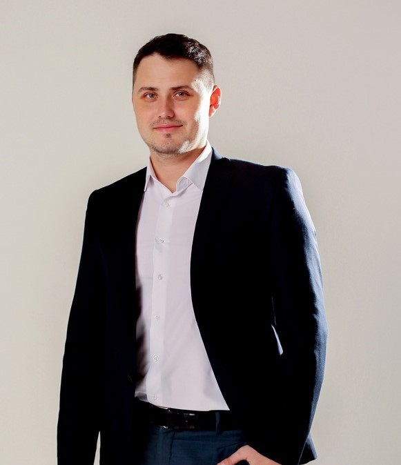

# Korolev Sergey
***

## __Junior Frontend Developer__

***

## Contact information:
***

E-mail: ksvladimirovich@gmail.com
Telegram: @sergiokzntip
Discord: Serjio(@sergei00026) Serjio (Сергей)#3941

***

## About Me
***

Краткая информация о себе (ваша цель и приоритеты, подчеркните свои сильные стороны, расскажите о своём опыте работы, если опыта работы нет, расскажите о своём стремлении учиться и узнавать новое)

## Skills
***

* HTML
* CSS/SASS/SCSS
* JavaScript (Basic)
* Git
* BEM
* Animations
* GULP
* Webpack

##Education
***

* __University:__ Kazan state Power Engineering University
* __Courses:__
 - HTML Academy
 - freelancer lifestyle
 - Udemy

## English
***

A1 (Understand and use everyday expressions, basic phrases aimed at meeting basic needs)

Рекомендации к составлению CV:

в CV добавьте своё фото или аватарку. Фото предпочтительнее
в CV укажите актуальные контакты для связи, в т.ч никнейм на дискорд-сервере rs school
в качестве примера кода приведите решение задачи с сайта Codewars.
Если решённых задач пока нет, подойдёт задача, которую нужно решить при регистрации на Codewars
код добавляется при помощи символов и тегов, а не картинкой
для выполненных проектов добавьте название проекта, ссылку на код проекта на гитхабе или ссылку на страницу проекта.
Если выполненных проектов пока нет, в качестве первого проекта укажите само CV